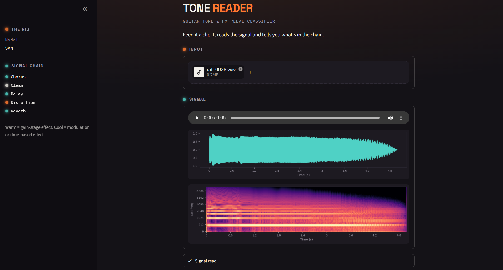

# 🎸 Tone Reader

### Guitar Tone & FX Pedal Classifier

   

A classical ML pipeline — Librosa + scikit-learn, no PyTorch or TensorFlow — that listens to a guitar clip and identifies which tone or effect pedal it's running through. End to end: raw audio in, feature engineering, a head-to-head model comparison, and a live web app out.


*Upload a clip, watch it move through the signal chain — waveform and mel-spectrogram rendered live, colored by the same warm/cool logic used everywhere else in the app.*

## Results

Trained and evaluated on [EGFxSet](https://egfxset.github.io/) across five classes — clean, distortion, chorus, delay, reverb — comparing two classical models head-to-head on an identical stratified split:

| Model | Accuracy | Macro F1 |
|---|---|---|
| **SVM** *(selected)* | **94.6%** | **94.6%** |
| Random Forest | 88.8% | 88.8% |

Both candidates are trained and scored on every run — the better one is saved automatically, not hand-picked.

## Pipeline

1. **Dataset preparation** — [`organize_dataset.py`](organize_dataset.py) sorts a downloaded EGFxSet extraction into `data/raw_audio/<class>/*.wav`.
2. **Feature extraction** — [`extract_features.py`](extract_features.py) computes MFCCs, spectral centroid, zero-crossing rate, and RMS energy (mean + std) per clip into a single feature CSV.
3. **Model training** — [`train.py`](train.py) trains and compares a Random Forest and an SVM on the same stratified split, evaluates both (confusion matrix, precision/recall/F1), and saves the stronger model.
4. **Inference** — [`predict.py`](predict.py) loads the saved model and classifies a single new clip through a reusable `TonePredictor` class.
5. **Web app** — [`app.py`](app.py) is a Streamlit interface for uploading a clip and getting a live reading, styled around an actual pedalboard rather than a generic dashboard.

## Setup

```bash
pip install -r requirements.txt

# 1. Get labeled training audio
python organize_dataset.py --source path/to/unzipped/EGFxSet --dest data/raw_audio

# 2. Extract features
python extract_features.py --data-dir data/raw_audio --output data/features/guitar_tone_features.csv

# 3. Train + evaluate
python train.py --features-csv data/features/guitar_tone_features.csv

# 4. Classify a clip from the command line
python predict.py --input path/to/some_clip.wav

# 5. Or launch the web app
streamlit run app.py
```

Optional: drop a few real clips into `examples/` (see `examples/README.md`) to get one-tap example buttons in the app instead of requiring an upload.

## Design

The UI is built around the actual vocabulary of guitar gear, not a generic SaaS dashboard: panels read like stompbox enclosures, a lit LED marks each active stage, and confidence is shown as a segmented VU-meter ladder rather than a plain bar chart. Color is functional, not decorative — warm amber marks gain-stage effects (distortion, overdrive, fuzz), cool teal marks modulation/time effects (chorus, flanger, phaser, delay, reverb), so the color itself carries information about *what kind* of effect the model thinks it's hearing, not just how confident it is.

## Why classical ML, not deep learning

Four hand-engineered features — MFCCs, spectral centroid, zero-crossing rate, RMS energy — carry enough signal to separate these tone classes without a neural network. Staying classical keeps every decision inspectable: which features drove a prediction, why the confusion matrix looks the way it does, why SVM edged out Random Forest here. That's a deliberate scope choice, not a limitation.

## Project structure

```
.
├── data/
│   ├── raw_audio/<class>/   # training clips, one folder per tone/effect label
│   └── features/            # extract_features.py output
├── models/                  # train.py output: best model, scaler, label encoder
├── reports/                 # train.py output: confusion matrices
├── examples/                # optional: real clips for the app's example picker
├── docs/                    # README assets
├── organize_dataset.py
├── extract_features.py
├── train.py
├── predict.py
├── app.py
└── requirements.txt
```
